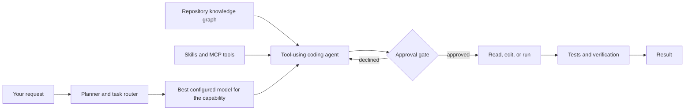

# Quasnex: Multi-Model AI Coding Agent and LLM Orchestrator

Quasnex is a Python CLI that routes software-development tasks to the right AI model, gives the selected model safe tools for working in your repository, and verifies code changes. Use hosted models through NVIDIA NIM or OpenRouter, connect a self-hosted OpenAI-compatible endpoint, or combine providers in one AI coding workflow.

[](https://www.python.org/downloads/)
[](https://www.langchain.com/langgraph)
[](https://github.com/CyberSurya43/ai_orchestrator)

> Quasnex follows one practical loop: **analyze -> implement -> verify**. The planner chooses a model for each task; the coding agent reads, edits, runs commands, and checks the result with your approval.

## What Quasnex does

- **Routes by capability:** selects models for planning, repository search, documentation, coding, debugging, testing, and deployment.
- **Works with multiple LLM providers:** supports NVIDIA NIM, OpenRouter, and self-hosted OpenAI-compatible APIs such as vLLM or Ollama.
- **Understands an existing codebase:** builds an incremental knowledge graph of files, symbols, and imports before the agent starts exploring.
- **Edits with safety gates:** asks before writing or deleting files, running shell commands, or calling external MCP tools.
- **Verifies changes:** detects the project's test command, runs it after edits, and gives the agent bounded attempts to repair failures.
- **Keeps project context:** stores project memory, knowledge-graph data, run artifacts, and persistent chat checkpoints when a project directory is supplied.
- **Extends through MCP and skills:** connects external Model Context Protocol tools and reusable Markdown workflows.

## Quick start

### 1. Install Quasnex

Requirements: Python 3.11 or newer, Git, and access to at least one supported model provider.

```bash
git clone https://github.com/CyberSurya43/ai_orchestrator.git
cd ai_orchestrator
python -m venv .venv
```

Activate the environment:

```bash
# macOS or Linux
source .venv/bin/activate

# Windows PowerShell
.venv\Scripts\Activate.ps1
```

Then install the CLI:

```bash
python -m pip install -e .
```

### 2. Configure one model provider

Copy the example configuration into the repository you want Quasnex to work on:

```bash
cd /path/to/your-project
cp /path/to/ai_orchestrator/.env.example .env
```

On Windows PowerShell, use `Copy-Item` instead of `cp` if needed. Choose one of the configurations below and disable providers you are not using.

<details open>
<summary><strong>OpenRouter</strong></summary>

```dotenv
DEFAULT_PROVIDER=openrouter

LIGHTNING_PROVIDER=false
NVIDIA_PROVIDER=false
OPENROUTER_PROVIDER=true

OPENROUTER_API_KEY=sk-or-v1-replace-me
OPENROUTER_MODELS=openrouter/auto
PLANNER_MODEL=openrouter:openrouter/auto
```

</details>

<details>
<summary><strong>NVIDIA NIM</strong></summary>

```dotenv
DEFAULT_PROVIDER=nvidia

LIGHTNING_PROVIDER=false
NVIDIA_PROVIDER=true
OPENROUTER_PROVIDER=false

NVIDIA_API_KEY=replace-me
NVIDIA_MODELS=openai/gpt-oss-120b,openai/gpt-oss-20b
PLANNER_MODEL=nvidia:openai/gpt-oss-120b
```

</details>

<details>
<summary><strong>Self-hosted OpenAI-compatible endpoint</strong></summary>

The provider key is named `lightning`, but it can point to any compatible chat-completions gateway.

```dotenv
DEFAULT_PROVIDER=lightning

LIGHTNING_PROVIDER=true
NVIDIA_PROVIDER=false
OPENROUTER_PROVIDER=false

LIGHTNING_BASE_URL=http://localhost:11434/v1
LIGHTNING_API_KEY=local-key
LIGHTNING_MODELS=qwen2.5-coder:14b
PLANNER_MODEL=lightning:qwen2.5-coder:14b
```

</details>

Never commit `.env`; it contains your provider credentials.

### 3. Start the coding agent

Run Quasnex from the root of the project you want it to inspect and modify:

```bash
quasnex chat
```

Try a request such as:

```text
Explain this repository and identify its main entry points.
```

For a file-changing task, Quasnex automatically uses the analyze, implement, and verify workflow:

```text
Add input validation to the signup endpoint and test the edge cases.
```

## How it works



1. Quasnex indexes the repository and ranks relevant files and symbols.
2. The planner classifies the task by domain, complexity, workload, and required workflow.
3. A configured specialist model receives the task and repository context.
4. The agent uses filesystem, shell, web, knowledge-graph, skill, or MCP tools.
5. Sensitive actions pause for confirmation.
6. After a code edit, Quasnex runs the detected test command when approved and reports the result.

If a routed provider fails during a chat task, Quasnex tries the next configured candidate for that capability.

## Everyday commands

### CLI commands

| Command | Purpose |
| --- | --- |
| `quasnex chat` | Work with the current repository in an interactive session. |
| `quasnex init ./my-app --name my-app` | Create a staged web-app orchestration project. |
| `quasnex plan ./my-app` | Generate task packets and refresh the knowledge graph. |
| `quasnex run ./my-app --execute` | Execute the configured multi-stage pipeline. |
| `quasnex context show ./my-app` | Inspect shared project context. |
| `quasnex integrations init` | Create an MCP and external-skills configuration. |
| `quasnex integrations list` | Show configured integrations. |

Run `quasnex --help` or `quasnex <command> --help` for the complete CLI reference.

### Commands inside `quasnex chat`

| Command | Purpose |
| --- | --- |
| `/plan <task>` | Analyze, implement, and verify a task. |
| `/build <task>` | Apply the built-in build workflow. |
| `/debug <task>` | Investigate and fix a bug. |
| `/test [task]` | Run or write tests. |
| `/deploy [task]` | Prepare a deployment. |
| `/model` | Select an eligible thinking model. |
| `/model auto` | Return to the configured planner model. |
| `/model reload` | Reload providers and models from `.env`. |
| `/providers` | List configured providers and model counts. |
| `/kg` | Show repository knowledge-graph statistics. |
| `/kg rebuild` | Force a full repository re-index. |
| `/skills` | List built-in and external skills. |
| `/mcp` | List configured MCP servers. |
| `/tools` | List tools available to the agent. |
| `/clear` | Start a fresh conversation thread. |
| `/help` | Show the complete command palette. |
| `/exit` | Close Quasnex. |

## Model routing and configuration

Provider inventories are comma-separated model IDs. A role override must use `<provider>:<model>` and the model must also appear in that provider's inventory.

```dotenv
LIGHTNING_MODELS=qwen2.5-coder:14b,qwen2.5-coder:7b
NVIDIA_MODELS=openai/gpt-oss-120b,qwen/qwen2.5-coder-32b-instruct
OPENROUTER_MODELS=openrouter/auto,nvidia/nemotron-3.5-lightning:free

PLANNER_MODEL=openrouter:openrouter/auto
REPOSITORY_SEARCH_MODEL=nvidia:openai/gpt-oss-120b
DOCUMENTATION_MODEL=nvidia:openai/gpt-oss-120b
CODING_MODEL=lightning:qwen2.5-coder:14b
DEBUGGING_MODEL=lightning:qwen2.5-coder:14b
TESTING_MODEL=nvidia:openai/gpt-oss-120b
DEPLOYMENT_MODEL=nvidia:openai/gpt-oss-120b
```

All role overrides are optional. Without them, Quasnex builds ordered candidates from the enabled provider inventories. Settings for temperature and transient-failure retries can be global or provider-specific:

```dotenv
DEFAULT_TEMPERATURE=0.2
DEFAULT_MAX_RETRIES=2

OPENROUTER_TEMPERATURE=0.1
OPENROUTER_MAX_RETRIES=3
```

After editing `.env` during a session, run `/model reload`. Model IDs are preserved exactly, including suffixes such as `:free`.

## Using Quasnex with an existing repository

Quasnex is installed once and run from any project directory. Do not copy the `ai_orchestrator` package into every application.

```text
~/tools/ai_orchestrator/       # Quasnex source and installation
~/projects/my-api/             # Repository Quasnex will work on
  .env                         # Provider configuration
  .orchestrator/               # Generated index and session artifacts
  src/
  tests/
```

```bash
cd ~/projects/my-api
quasnex chat
```

Plain `quasnex chat` uses the current directory as the workspace. The `--project-dir` option is intended for projects created by `quasnex init`; in that layout, the code lives under `<project-dir>/workspace/`.

## Knowledge graph and project memory

At chat startup, Quasnex incrementally indexes supported source files into `.orchestrator/knowledge_graph.json`. The graph records files, functions, classes, and import relationships. Repository-related prompts are resolved against this graph before broad file exploration.

Use `/kg` for statistics or `/kg rebuild` after a large structural change. The agent can also call `resolve_issue`, `kg_stats`, and `build_knowledge_graph` while working.

Project data is kept separate by purpose:

| Path | Contents |
| --- | --- |
| `.orchestrator/knowledge_graph.json` | Incremental repository index. |
| `.orchestrator/context.json` | Remembered facts, preferences, and decisions. |
| `.orchestrator/chat_state.sqlite` | Persistent chat checkpoints for scaffolded `--project-dir` sessions. |
| `.orchestrator/runs/` | Plans, task packets, handoffs, and run state. |

## MCP servers and external skills

Install optional Model Context Protocol support from the Quasnex checkout:

```bash
python -m pip install -e ".[mcp]"
```

In the repository where you want to use integrations:

```bash
quasnex integrations init
quasnex integrations list
```

This creates `.quasnex.json`. Quasnex supports local `stdio`, remote `streamable-http`, and legacy `sse` MCP transports.

```json
{
  "mcpServers": {
    "local-tools": {
      "transport": "stdio",
      "command": "/absolute/path/to/python",
      "args": ["/absolute/path/to/mcp_server.py"],
      "env": {"SERVICE_TOKEN": "${SERVICE_TOKEN}"},
      "timeout": 30
    },
    "remote-tools": {
      "transport": "streamable-http",
      "url": "https://your-server.example/mcp",
      "headers": {"Authorization": "Bearer ${MCP_API_TOKEN}"},
      "timeout": 60
    }
  },
  "skills": ["/absolute/path/to/my-skills"]
}
```

Environment placeholders are resolved from the project `.env`, then from the process environment. Quasnex asks for confirmation before connecting to a server or calling one of its tools. Each operation creates a new MCP session; MCP resources, prompts, and OAuth login flows are not currently exposed.

Add a project skill at `.quasnex/skills/<skill-name>/SKILL.md`, or add an external skill path to the `skills` array in `.quasnex.json`:

```markdown
# API debugging

1. Reproduce the request and inspect the relevant code.
2. Use configured MCP tools for logs or current documentation.
3. Fix the root cause and run focused tests.
4. Report the changed files, verification, and remaining risks.
```

Use the skill in chat with `/skill api-debug Fix the login endpoint returning 500`.

## Agent tools

| Category | Available tools |
| --- | --- |
| Filesystem | `read_file`, `list_dir`, `project_tree`, `glob_files`, `search_code`, `write_file`, `edit_file`, `delete_file` |
| Shell | `run_shell`, `run_tests`, `git_status`, `git_diff` |
| Current knowledge | `web_search`, `fetch_url` |
| Knowledge graph | `build_knowledge_graph`, `resolve_issue`, `kg_stats` |
| Memory | `remember`, `recall` |
| Skills | `list_available_skills`, `load_skill_instructions`, `load_skill_resource` |
| MCP | `list_mcp_servers`, `list_mcp_tools`, `call_mcp_tool` |
| Scaffolding | `scaffold_project` |

## Development

Install development dependencies and run the test suite:

```bash
python -m pip install -e ".[dev,mcp]"
python -m pytest
```

Repository layout:

```text
ai_orchestrator/
  agent_tools/       # Filesystem, shell, web, KG, skill, and MCP tools
  cli/               # CLI commands and terminal UI
  config/            # Provider, model-route, and project configuration
  core/              # Agent graph and staged orchestrator
  knowledge_graph/   # Repository indexing and issue resolution
  llm/               # Provider clients, registry, and planner router
  scaffolding/       # Project templates and generation
  skills/            # Built-in plan/build/test/debug/deploy workflows
examples/
tests/
```

## Frequently asked questions

### What is Quasnex?

Quasnex is a multi-model AI coding orchestrator for the terminal. It combines task-aware LLM routing, repository context, coding-agent tools, approval gates, and post-edit test verification.

### Can Quasnex use local LLMs?

Yes. Connect a local or self-hosted server that exposes an OpenAI-compatible chat-completions API, then configure its base URL and model IDs with the `LIGHTNING_*` settings.

### Does Quasnex require one specific AI provider?

No. You can use a single provider or mix NVIDIA NIM, OpenRouter, and a self-hosted endpoint. Capability routes can select different providers for planning, coding, testing, or deployment.

### Will Quasnex change files without asking?

No. File writes, edits, deletions, shell commands, and external MCP actions require interactive confirmation. Repository reads and local knowledge-graph searches do not.

### Is Quasnex a multi-agent framework?

Quasnex uses planner-driven, capability-based model delegation. Its staged pipeline can apply different engineering personas and model routes, while the same tool-using agent runtime performs repository work.

## Project links

- [Source code](https://github.com/CyberSurya43/ai_orchestrator)
- [Issue tracker](https://github.com/CyberSurya43/ai_orchestrator/issues)
- [Environment configuration template](.env.example)
- [Example project](examples/README.md)

Search ranking cannot be guaranteed by README changes alone. A public repository, accurate GitHub description and topics, releases, inbound links, and—ideally—a dedicated crawlable documentation site all help search engines discover and understand Quasnex.
